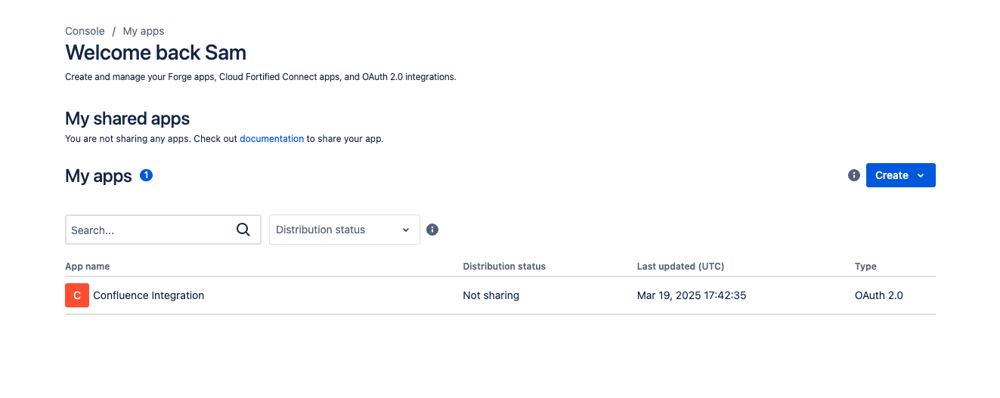

# Confluence Integration Server

A Node.js + TypeScript server that integrates with Confluence Cloud using the REST API and OAuth 2.0 authentication.

## Features

- OAuth 2.0 login flow using `/oauth` and session-based storage
- Secure access to Confluence REST API (pages, spaces)
- Express.js server with TypeScript
- Automated testing using Mocha and Chai
- Session-based integration testing setup with `axios-cookiejar-support`

---

## Prerequisites

- Node.js >= 18.0.0
- npm
- Confluence Cloud instance with API access
- Atlassian OAuth 2.0 credentials (Client ID and Secret)

## Atlassian App Configuration

Below is the screenshot of the app configuration from developer.atlassian.com:




---

## Setup

### 1. Clone the repository

```bash
git clone <repository-url>
cd confluence-integration
```

### 2. Install dependencies

```bash
npm install
```
### 3. Create your `.env` file

```bash
cp .env.example .env
```

### 4. Create your `.env.test` file

```bash
cp .env.test.example .env.test
```
### 5. Fill in the required environment variables in `.env`

```env
PORT=3000
NODE_ENV=development
CONFLUENCE_CLIENT_ID=your-client-id
CONFLUENCE_CLIENT_SECRET=your-client-secret
SESSION_SECRET=keyboard cat
CONFLUENCE_DOMAIN=https://your-domain.atlassian.net
AUTH_REDIRECT_URI=http://localhost:3000/oauth/callback
```

---

## Running the Server

### Build the project
```bash
npm run build
```

### Start in production mode
```bash
npm start
```

### Start in development mode (with hot reload)
```bash
npm run dev
```

---

## API Endpoints

### 🔐 OAuth Flow

- `GET /oauth` – Redirects to Atlassian login
- `GET /oauth/callback` – Handles the authorization code exchange and saves session

### 📄 Pages

- `GET /api/pages/:pageId` – Fetch a single page by ID
- `GET /api/spaces/:spaceId/pages` – List all pages in a specific space

### 🧱 Spaces

- `GET /api/spaces` – List all spaces
- `GET /api/spaces/:spaceId/pages` – List all pages in a specific space

All endpoints require a valid session, created after authenticating via `/oauth`.

---

## Testing

### ⚙️ Test Setup

1. Log in once via `/oauth` to get a valid `accessToken` and `cloudId`.
2. Run the following script to generate a `.env.test` file:

```bash
npm run update-env
```

You'll be prompted to paste in your `accessToken` and `cloudId`.

### Run tests

```bash
npm test
```

### What the Tests Do

- Spin up a local server on a separate port (3001)
- Call `/test/login` to simulate a valid session
- Test protected endpoints using a session-aware client
- Validate both successful and failing scenarios (404s, 401s)

---

## Scripts

| Command              | Description                                      |
|----------------------|--------------------------------------------------|
| `npm start`          | Start server                                     |
| `npm run dev`        | Start dev server with nodemon                    |
| `npm run build`      | Compile TypeScript                               |
| `npm test`           | Run Mocha/Chai tests using `.env.test`          |
| `npm run update-env` | Generate `.env.test` for test session injection |
| `npm run lint`       | Lint code using ESLint                           |

---

## Project Structure

```
src/
├── controllers/
├── routes/
├── middleware/
├── services/
├── types/
├── index.ts
test/
├── pages.test.ts
├── spaces.test.ts
├── setup.ts
├── helpers.ts
scripts/
├── update-env-test.ts
```


